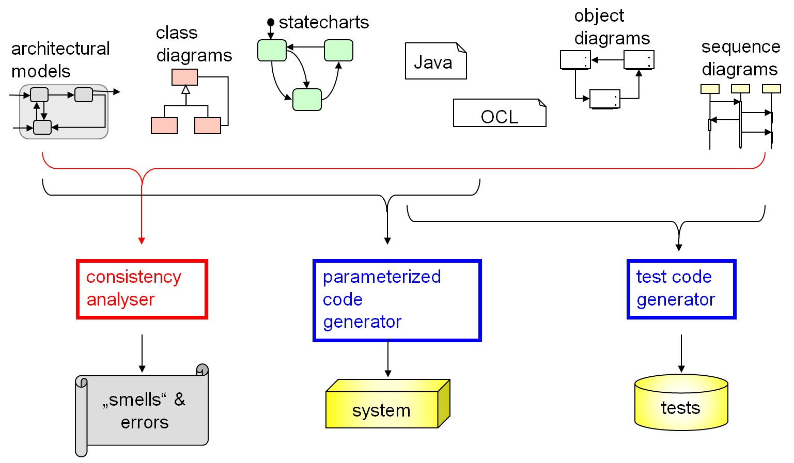

# cryopreservation-panda

With this application it is possible to teach a Franka Emika Panda how to thaw biological samples.

The system structure is looking like:

## Requirements

Hardware:

- Franka Emika Panda with firmware: 
- 

- the 3D printed gripper

## Installation

## Execution

### Setup

### Camera Calibration

### Teaching

## Study

### Process Description

Following the required steps are listed:

Part 0:
- Detect freezer
- Detect handling position 0
- Detect handling position 1
- Detect water bath
- (Turn on water bath)
- (Check temperatur)

Part 1:
- Open freezer
- Open compartment
- Grab correct box
- Put box in handling position
- Close compartment
- Close freezer

Part 2:
- Open box
- Pick correct vessel
- Put it into holder
- Open wather bath
- Put holder into water bath
- Close Water bath

Part 3:
- Close box 
- Execute Part 1 (put box back into freezer)

Part 4:
- Open water bath
- Pull holder out of water bath
- Close water bath

### Evaluation

### Difficulties & Problems

## ToDo

Here you can find stuff which should be fixed: [ToDo](todo.html)

# Trash

[Go to this page](documentation/MyOtherPage.md)
