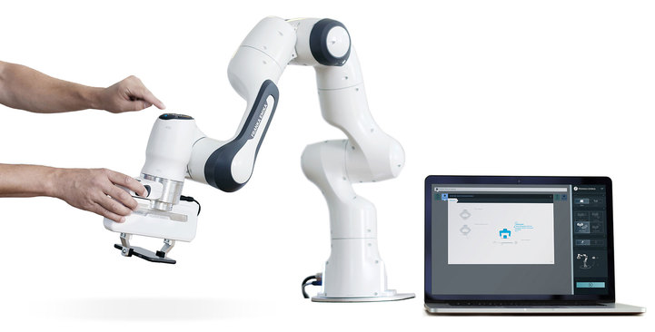
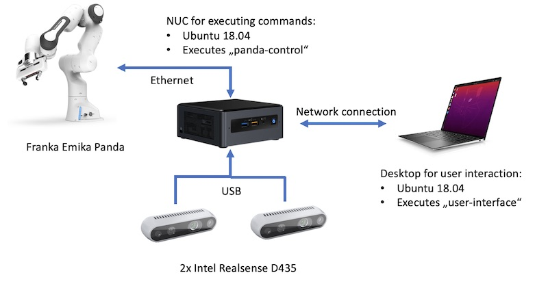

---

---

# cryopreservation-panda

With this application it is possible to teach a Franka Emika Panda how to thaw biological samples.




### Video

An example video is uploaded on: [YouTube](https://www.google.de)

### System Structure




## Requirements

- NUC with Ubuntu 18.04
- Franka Emika Panda connected to the NUC
- Two Intel Realsense D435 connected to the NUC
- A desktop computer with Ubuntu 18.04 in the same network as the NUC
- The 3D printed gripper model mounted on the Panda: [Link](https://github.com/TheGaertner/cryopreservation-panda/tree/master/user-interface)


## Installation

Clone the git repository to the home directory of *Desktop* and *NUC*:

```bash
cd
git clone https://github.com/TheGaertner/cryopreservation-panda
cd cryopreservation-panda
```

On *Desktop* execute:

```bash
sudo ./scripts/required_programs.sh
sudo ./scripts/install_dependecies_basic.sh
sudo ./scripts/add_deploy_command.sh
sudo ./user-interface/scripts/install_additional_dependecies.sh
```

On *NUC* execute:

```bash
sudo ./scripts/install_dependecies_basic.sh
```


## Execution

### Create Documentation

```bash
cd documentation
doxygen Doxyfile
```

Afterwards the documentation can be opened with:

```bash
firefox build/html/index.html 
```

### Setup

On *Desktop* execute:

```
nano configs/main.yaml
```

Edit the file to your robot parameters

```yaml
robot:
  ip: 192.168.3.101 # Ip of the Panda
  desk_username: franka
  desk_password: frankaRSI
nuc:
  hostname: biolab-041
  ssh_username: panda
  ssh_password: panda
  tcp_port: 5000 # Pick a free port
  udp_port: 4005 # Pick a free port
  camera_0:
    name: /dev/video4 # Look up the device name of the Intel Realsense
    port: 6000 # Pick a free port
    on: true
  camera_1:
    name: /dev/video10 # Look up the device name of the Intel Realsense
    port: 6001 # Pick a free port
    on: true
client:
  udp_port: 4001 # Pick a free port
```


### Start Software

On *Desktop*:


~~~{.sh}
sudo test 
~~~


### Camera Calibration

### Teaching

## Study

### Process Description

Following the required steps are listed:

Part 0:
- Detect freezer
- Detect handling position 0
- Detect handling position 1
- Detect water bath
- (Turn on water bath)
- (Check temperatur)

Part 1:
- Open freezer
- Open compartment
- Grab correct box
- Put box in handling position
- Close compartment
- Close freezer

Part 2:
- Open box
- Pick correct vessel
- Put it into holder
- Open wather bath
- Put holder into water bath
- Close Water bath

Part 3:
- Close box 
- Execute Part 1 (put box back into freezer)

Part 4:
- Open water bath
- Pull holder out of water bath
- Close water bath


### Evaluation

### Difficulties & Problems

## ToDo

Here you can find stuff which should be fixed: [ToDo](todo.html)


# Trash

[Go to this page](documentation/MyOtherPage.md)
